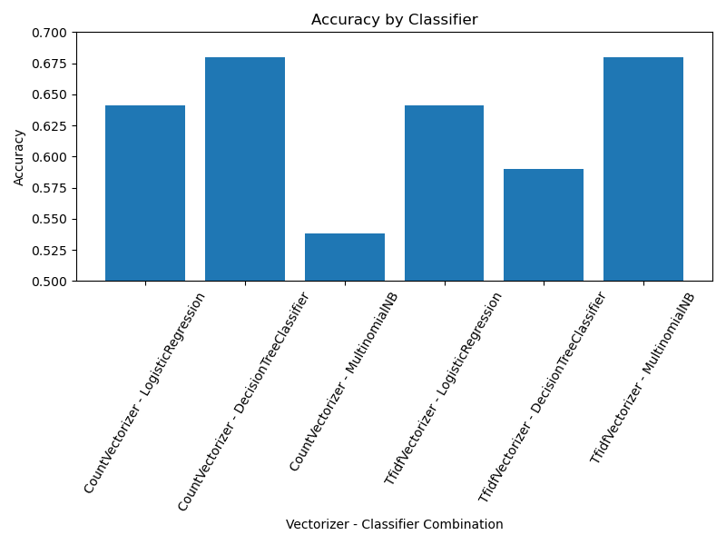

### Using Text Classification to Predict Stock Market Sentiment

**Odean Maye**

#### Executive Summary

This project focuses on using text classification analysis to predict bullish and bearish market sentiment for daily stock trading sessions. Predictive models in this domain can provide significant value by aiding in capital accretion (the process of growing investment returns) and risk management. By classifying pre-market news articles, the project aims to explore how natural language processing (NLP) and machine learning can predict whether a trading day will yield a positive or negative return.

#### Rationale

Stock market predictions based on sentiment analysis can offer traders and investors a competitive edge. Sentiment-driven predictions enable market participants to anticipate trends and align their strategies with the expected outcomes. This reduces uncertainty, optimizes risk management, and fosters better decision-making, especially in volatile or unpredictable markets. Understanding the sentiment behind pre-market news can reveal underlying market behavior and help manage exposure to potential losses while capitalizing on favorable trends.

#### Research Question

Can pre-market news be used to predict the daily market sentiment?

#### Data Sources

The data for this project is sourced from:
- Pre-market news articles scraped from popular financial market news sites, including CNBC and Bloomberg.
- Publicly available stock market data to track daily stock performance.

#### Methodology

1. **Data Collection**: Pre-market news articles are aggregated from financial news websites and matched with daily stock performance data.
2. **NLP Preprocessing**: Pre-market news data is processed using lemmatization. Various vectorization methods, such as `CountVectorizer` and `TfidfVectorizer`, are applied.
3. **Classification**: Machine learning classification algorithms, including `LogisticRegression`, `DecisionTreeClassifier`, and `MultinomialNB`, are employed to predict whether a trading day will yield a return greater than or less than 0.
4. **Evaluation**: Models are evaluated against a baseline accuracy derived from guessing the most likely outcome, and the best-performing model is selected based on accuracy and classification metrics.

#### Results

- **Data Collection**: Data from June 2024 through October 2024 was collected, covering 105 trading sessions.
- **Baseline**: A 58% baseline accuracy was established by always predicting a positive trading day (61 out of the 105 trading sessions in the time period were positive).
- **Preprocessing**: Various models were created by combining vectorizers and classifiers in different combinations.

- **Best Model**: 
  - **Vectorizer**: TfidfVectorizer
  - **Classifier**: MultinomialNB
  - **Best Parameters**: {'MultinomialNB__alpha': 0.5, 'MultinomialNB__fit_prior': True}
  - **Accuracy**: 70.4%
- **Classification Report**

  | Class | Precision | Recall | F1-Score | Support |
  |-------|-----------|--------|----------|---------|
  | **0** | 0.67      | 0.14   | 0.24     | 14      |
  | **1** | 0.50      | 0.92   | 0.65     | 13      |

  **Overall Metrics**:
  - **Cross-Validation Accuracy**: 70.4%
  - **Test Accuracy**: 52.0%
  - **Macro Average**:
    - **Precision**: 0.58
    - **Recall**: 0.53
    - **F1-Score**: 0.44
  - **Weighted Average**:
    - **Precision**: 0.59
    - **Recall**: 0.52
    - **F1-Score**: 0.43

**Summary**:
- The classifier struggles to identify instances of class `0` (negative trading days), as shown by the low recall (14%). However, it performs much better for class `1` (positive trading days), achieving a recall of 92%.
- Precision for class `0` (67%) indicates that when the model predicts a negative trading day, it is relatively accurate. However, the low F1-score (24%) highlights poor balance between precision and recall.
- The cross-validation accuracy during training was **70.4%**, indicating the model's potential to capture patterns in the data.
- However, the test accuracy on a holdout dataset was **52%**, showing that the model's generalization ability is limited. This gap suggests the need for:
  - More data to improve performance and reduce overfitting.
  - Adjustments to address class imbalance, as class `0` had fewer correctly identified instances.
  - Exploration of alternative algorithms or advanced techniques like ensemble methods or deep learning.

## Next Steps

- **Expand Data**: Train the model on at least one or two years of data for improved performance.
- **Explore Advanced Models**: Experiment with deep learning architectures and other classification algorithms to enhance prediction accuracy.

## Project Outline

The project is organized into a single Jupyter notebook with clearly defined sections covering data collection, preprocessing, model training, and evaluation.

- [Capstone Evaluation Notebook](https://github.com/odeanmaye/Berkeley/blob/main/Capstone/CapstoneEvaluation.ipynb)

## Contact Information

**Odean Maye**  
Email: odean@spectususa.com