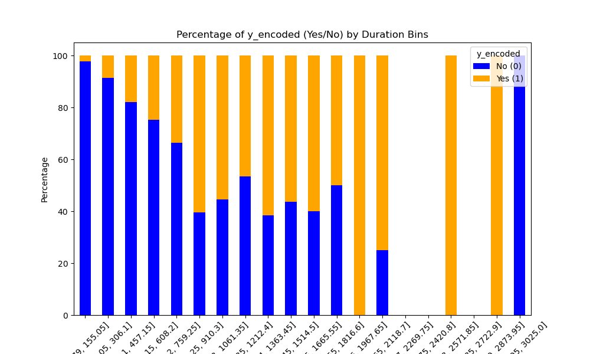

# 17.1 Readme

## Business Understanding of the Problem
The data represents direct marketing campaigns of a Portuguese banking institution. The classification goal is to predict if the client will subscribe to a term deposit account offer during a phone call.

## Data Analysis and Cleaning
The data has 17 input variables that can be used to predict the output variable `y`.

| Variable   | Data Type | Description |
|------------|------------|-------------|
| age        | integer    | Age of the participant |
| job        | string     | Type of job (categorical: "admin.", "unknown", "unemployed", "management", "housemaid", "entrepreneur", "student", "blue-collar", "self-employed", "retired", "technician", "services") |
| marital    | string     | Marital status (categorical: "married", "divorced", "single"; note: "divorced" means divorced or widowed) |
| education  | string     | Education level (categorical: "unknown", "secondary", "primary", "tertiary") |
| default    | binary     | Has credit in default? (binary: "yes", "no") |
| balance    | integer    | Average yearly balance, in euros |
| housing    | binary     | Has housing loan? (binary: "yes", "no") |
| loan       | binary     | Has personal loan? (binary: "yes", "no") |
| contact    | string     | Contact communication type (categorical: "unknown", "telephone", "cellular") |
| day        | integer    | Last contact day of the month |
| month      | string     | Last contact month of the year (categorical: "jan", "feb", "mar", ..., "nov", "dec") |
| duration   | integer    | Last contact duration, in seconds |
| campaign   | integer    | Number of contacts performed during this campaign and for this client (includes last contact) |
| pdays      | integer    | Number of days that passed since the client was last contacted from a previous campaign (-1 means the client was not previously contacted) |
| previous   | integer    | Number of contacts performed before this campaign and for this client |
| poutcome   | string     | Outcome of the previous marketing campaign (categorical: "unknown", "other", "failure", "success") |
| y          | binary     | Has the client subscribed to a term deposit? (binary: "yes", "no") |

To clean and prepare this data, rows with null or "unknown" values were removed. Variables such as contact, day, and month, which are unlikely to impact the outcome, were dropped. The job variable was bucketed into relative levels of risk based on income stability, with management being the highest and unemployed being the lowest.

### Logistic Regression Coefficient Analysis
- **Duration** has the largest positive coefficient (1.011661), suggesting it is the most important predictor.
- **Housing_encoded** has a notable negative coefficient (-0.432275), indicating an inverse relationship with the outcome.
- **Campaign** and **loan_encoded** have moderate negative coefficients.
- **Education_encoded**, **pdays**, and **marital_encoded** show smaller contributions.

### Random Forest Feature Importance Analysis
- **Duration**: Highest importance (0.359080), a key predictor in both Random Forest and Logistic Regression.
- **Balance**: Second highest importance (0.172196), though less significant in Logistic Regression.
- **Age**: High importance in Random Forest but small in Logistic Regression.
- **Pdays** and **Campaign**: Moderate importance across both models.
- **Previous**: Moderate importance in Random Forest.

### Variables with Lower Importance:
- **Education_encoded**, **job_encoded**, **housing_encoded**, **marital_encoded**, **loan_encoded**, and **default_encoded** may not significantly improve classification accuracy.

## Baseline
Participants responded "no" to the offer 88.45% of the time. This baseline represents the accuracy of guessing "no" for every case. Any useful model should perform better than this.

## Classification Results

### Classification with Just the Duration Variable:

| Model                  | Train Score | Test Score | Comparison to Baseline |
|------------------------|-------------|------------|------------------------|
| Logistic Regression     | 88.47%      | 89.95%     | +1.70%                 |
| K-Nearest Neighbors     | 89.26%      | 89.49%     | +1.18%                 |
| Support Vector Machine  | 88.83%      | 89.95%     | +1.70%                 |
| Decision Tree           | 90.42%      | 88.64%     | +0.21%                 |

### Classification with 7 Variables (Duration, Housing, Campaign, Loan, Education, Pdays, and Marital):

| Model                  | Train Score | Test Score | Comparison to Baseline |
|------------------------|-------------|------------|------------------------|
| Logistic Regression     | 88.79%      | 89.56%     | +1.25%                 |
| K-Nearest Neighbors     | 89.62%      | 89.56%     | +1.25%                 |
| Support Vector Machine  | 90.05%      | 89.80%     | +1.53%                 |
| Decision Tree           | 91.42%      | 88.87%     | +0.47%                 |

### Classification with 5 Variables (Duration, Balance, Age, Campaign, and Pdays):

| Model                  | Train Score | Test Score | Comparison to Baseline |
|------------------------|-------------|------------|------------------------|
| Logistic Regression     | 88.50%      | 89.80%     | +1.53%                 |
| K-Nearest Neighbors     | 89.36%      | 89.64%     | +1.35%                 |
| Support Vector Machine  | 88.10%      | 89.57%     | +1.27%                 |
| Decision Tree           | 92.91%      | 88.10%     | -0.40%                 |

## Findings

- **Duration** was the most significant predictor across all models. The longer the call, the more likely the client subscribed.
- Logistic Regression and Support Vector Machines both showed a **1.7% improvement** over the baseline using only duration.
- Including features such as **housing loan status** and **campaign count** yielded smaller improvements, with the highest improvement being **1.53%**.

## Actionable Items for Non-Technical Audience

- **Key Insight**: Focus marketing efforts on ensuring longer call durations, as this was the strongest predictor of success.
- **Secondary Factors**: Consider financial stability (balance, housing loan status), but these have less impact than call duration.
- **Variable Importance**: Variables such as job and marital status do not significantly impact subscription rates.

## Next Steps and Recommendations
1. **Optimize Call Durations**: Implement strategies to increase average call duration.
2. **Refine Campaign Targeting**: Use predictive features like balance and age, but prioritize call quality and duration.
3. **Simplify Predictive Models**: Use the top 5 key variables to maintain strong predictive power while simplifying the analysis.

